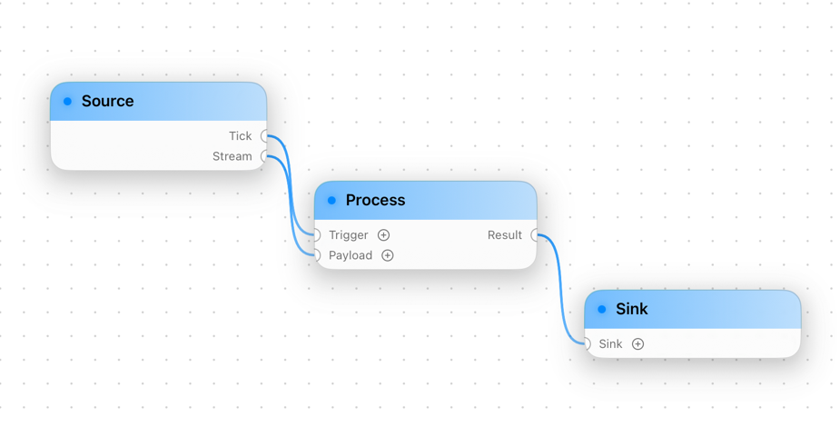
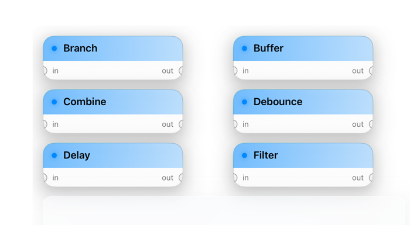

# NodeKit

A SwiftUI node-graph editor for iOS, iPadOS, macOS and visionOS.

NodeKit gives you a pannable, zoomable canvas of glassy nodes connected by
bezier wires, a paginated template browser for dragging new nodes onto the
canvas, and a registry-driven plug-in surface for adding your own port types
and inline value editors. It's intentionally headless of any execution model —
NodeKit owns the editing experience, your app owns what the graph *means*.

<p align="center">
  
</p>

## Features

- **`GraphEditor`** — pan/zoom canvas with glass nodes, port-drag-to-connect,
  bezier wires, dot-grid background, multi-select and delete.
- **`TemplateRegistryView`** — paginated, drag-source template browser.
- **Custom port types** — register your own ``PortType`` and SwiftUI inline
  editor; NodeKit handles JSON round-tripping for you.
- **`Codable` everywhere** — `Graph`, `Node`, `NodeTemplate`, `PortValue` all
  round-trip to disk, iCloud or a server with `JSONEncoder`.
- **Multiplatform** — single codebase for iOS 26, iPadOS 26, macOS 26 and
  visionOS 26.

## Install

NodeKit is a Swift Package. Add it from Xcode (*File ▸ Add Package
Dependencies…*) or in `Package.swift`:

```swift
.package(url: "https://github.com/itspolly/NodeKit.git", from: "0.1.0"),
```

Then add `"NodeKit"` to your target's dependencies and `import NodeKit`.

> NodeKit requires the Swift 6.3 toolchain and targets iOS 26 / macOS 26 /
> visionOS 26 — it uses the system glass material.

## Quick start

```swift
import SwiftUI
import NodeKit

struct ContentView: View {
    @State private var graph = Graph(nodes: [])
    @State private var filter: TemplatePredicate = .filter(name: nil, scope: nil)
    let templates = TemplateRegistry()

    var body: some View {
        HStack(spacing: 0) {
            TemplateRegistryView(templateRegistry: templates, predicate: $filter)
                .frame(width: 320)
            GraphEditor(graph: $graph, templateRegistry: templates)
        }
    }
}
```

Register a few `NodeTemplate`s with the registry (each with input/output
`Port`s of a known `PortType`) and you're done — drag templates from the
browser onto the canvas, then drag from one node's output to another's
compatible input to wire them up.

> ⚠️ **Required Info.plist entry.** The browser-to-canvas drag uses a custom
> UTI, `is.polly.nodekit.template`, that the host app must export. Add it
> under *Exported Type Identifiers* (conforming to `public.data`) or the
> drag will refuse to start. The [Getting Started guide][gs] has the exact
> plist snippet.

<p align="center">
  
</p>

See the [Getting Started guide][gs] for a full walkthrough and the
[full API reference][docs] for everything else.

[gs]: https://nodekit.jamie.software/documentation/nodekit/gettingstarted
[docs]: https://nodekit.jamie.software/documentation/nodekit

## Documentation

Rich Swift-DocC documentation — including the *Getting Started* and *Adding
custom port types* guides — is published to GitHub Pages from the `docs/`
folder on `main`:

**📚 [nodekit.jamie.software][docs]**

Regenerate it locally before pushing:

```sh
swift package --allow-writing-to-directory ./docs \
    generate-documentation --target NodeKit \
    --output-path ./docs \
    --transform-for-static-hosting

# DocC wipes the output directory, so restore the CNAME and root redirect:
echo nodekit.jamie.software > docs/CNAME
cat > docs/index.html <<'HTML'
<!doctype html>
<meta http-equiv="refresh" content="0; url=./documentation/nodekit/">
<link rel="canonical" href="./documentation/nodekit/">
HTML
```

Then commit the updated `docs/` and push. GitHub Pages should be configured
to serve from the **`main` branch / `/docs` folder**.

## License

MIT. See [LICENSE](LICENSE).
